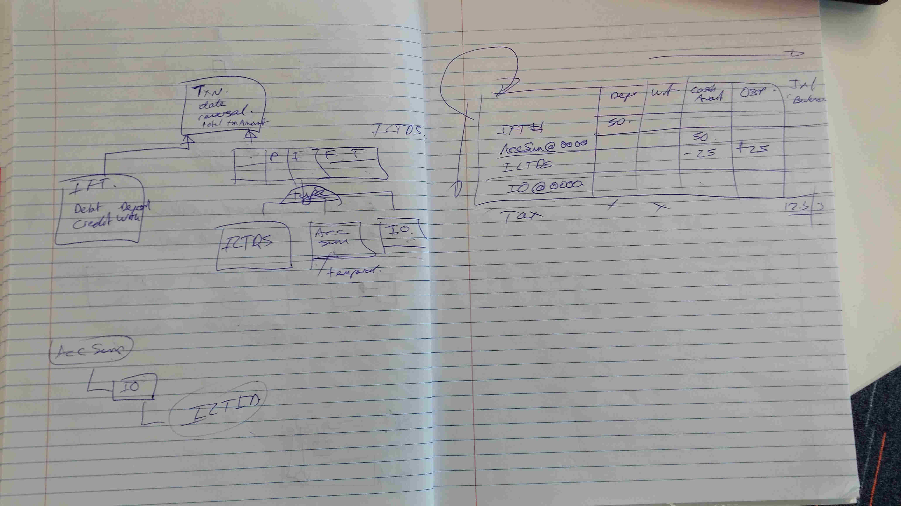
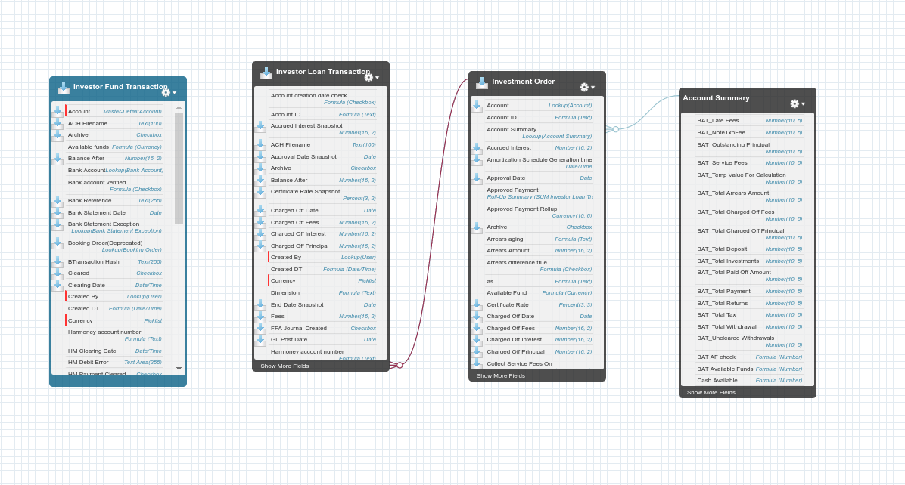

#ims-core-message-processor

The role of the Message Processor is to receive messages from the [bayeux](https://en.wikipedia.org/wiki/Comet_(programming)) queue generated by Salesforce triggers which fire when new records/objects are created in the Salesforce database.

Messages describe the new record and the Message Processor gives them an initial check before saving them into a local database. The local database is actually a postgres database normally hosted on AWS. It *might* be a MoM. The format of the queue entries is some key information plus a blob containing the raw message. Incoming messages may contain multiple sub messages (ie refer to multiple record updates) and the message processor will break thes up into multiple internal queue entries. It will not do much else.

There are restart scenarios: the server might restart, the client (ie the Message Processor) might restart. Both need to be handled cleanly. Messages are numbered but not necessarily contiguously. The Message Processor will at least need to remember the last processed message and request new messages from that plus one. That's a db save because if it crashes it won't have memory.

The Message Processor does not process the messages directly. It will probably split them up into several sub-messages (yet to nail down the message format but this seems likely) and save them into an internal queue which is a rabbitMQ topic named *transaction-queue* (configurable)

##SalesForce Tables




The Investor Fund Transaction is like the Account Summary and Investment Order, they all extend a 'virtual' parent, which means they *ought* to extend one but it doesn't exist. The goal is to get these to a flat single table which eliminates duplicate fields but contains potentially empty fields when those fields belong to a different 'type'.

## Connecting to Salesforce
The topics (not the SOAP API) need to know your IP address for security reasons. Use Quick Find to search for Network and open up 'Network Access'
Make sure your current IP is in one of those ranges.
To find your current ip address Google: my ip address

## Creating a Topic

https://developer.salesforce.com/docs/atlas.en-us.api_streaming.meta/api_streaming/create_a_pushtopic.htm

```
PushTopic pushTopic = new PushTopic();
pushTopic.Name = 'InvestorLoanTransactionInserts';
pushTopic.Query = 'SELECT Id, 
	Name, 
	Status__c, 
	Description__c 
	FROM loan__Investor_Loan_Account_Txns__c	';
pushTopic.ApiVersion = 38.0;
pushTopic.NotifyForOperationCreate = true;
pushTopic.NotifyForOperationUpdate = true;
pushTopic.NotifyForOperationUndelete = true;
pushTopic.NotifyForOperationDelete = true;
pushTopic.NotifyForFields = 'Referenced';
insert pushTopic;

```

```
PushTopic pushTopic = new PushTopic();
pushTopic.Name = 'ILTIMS';
pushTopic.Query = 'SELECT Id,Name,CreatedDate, \
	loan__Principal_Paid__c,loan__Interest_Paid__c, \
	loan__Late_Fees_Paid__c,loan__Tax__c, \
	loan__Total_Service_Charge__c,loan__Charged_Off_Date__c, \
	loan__Charged_Off_Fees__c,loan__Charged_Off_Interest__c, \
	loan__Charged_Off_Principal__c,Investor_Txn_Fee__c, \
	loan__Txn_Code__c,loan__Waived__c, \
	loan__Protect_Principal__c,Management_Fee_Realised__c, \
	Sales_Commission_Fee_Realised__c,loan__Rebate_Amount_On_Payoff__c, \
	Protect_Realised__c FROM loan__Investor_Loan_Account_Txns__c';
pushTopic.ApiVersion = 38.0;
pushTopic.NotifyForOperationCreate = true;
pushTopic.NotifyForOperationUpdate = true;
pushTopic.NotifyForOperationUndelete = true;
pushTopic.NotifyForOperationDelete = true;
pushTopic.NotifyForFields = 'Referenced';
insert pushTopic;
```

(note that it does *not* like the query split over multiple lines and it does not like
references to attached objects, eg querying the account id through the attached account record doesn't work.

Format of message is:

{event={createdDate=2017-02-21T08:20:09.181Z, replayId=33, type=created}, 
sobject={Description__c=whatever, Id=a6fN00000008giLIAQ, Status__c=Open, Name=INV-0033}}

This is a HashMap whose values are hashmaps. All the keys are Strings. The values are whatever datatype is suitable, often a String but could be a Date, Long etc. Currency is a String, number() is a double. What is date? Percentage?
Date is a string, percentage is double.

Deleting a pushTopic:

```
List<PushTopic> pts = [SELECT Id FROM PushTopic WHERE Name = 'ILTIMS'];
Database.delete(pts);
``` 


